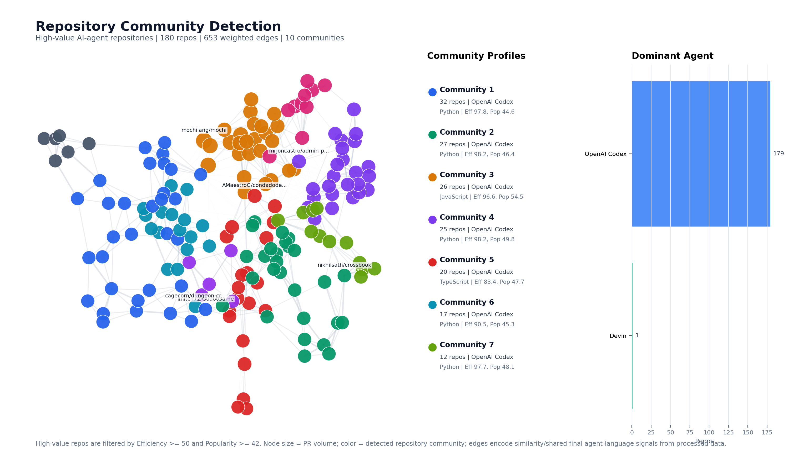
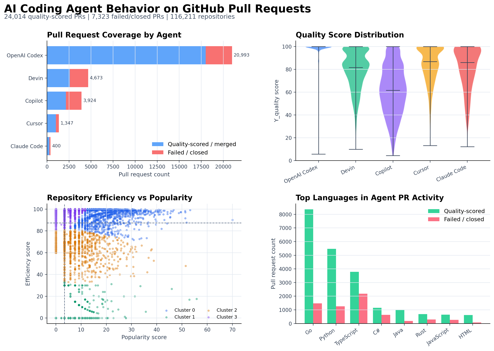
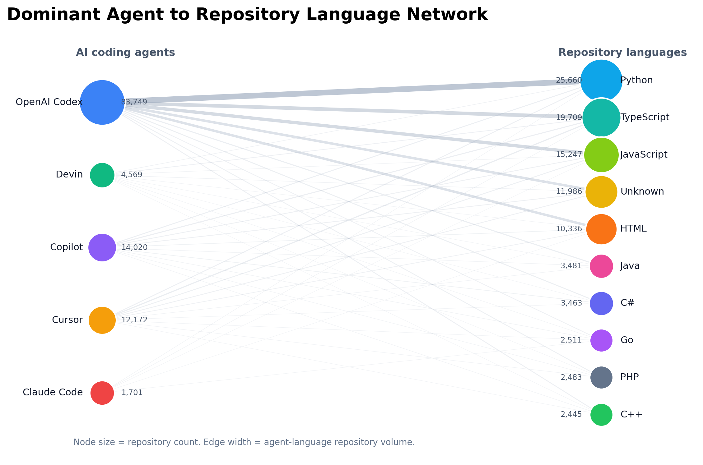

# GitHub AI Agent Behavior Research

This repository contains an empirical research project on AI coding-agent behavior in GitHub pull request activity. The analysis studies pull request quality, failure patterns, and repository-level collaboration networks associated with AI-agent-generated development work.

The project was originally completed as a university research project by Zihao Sheng and Wei Li. It has been reorganized into a portfolio-ready research repository with a clear separation between notebooks, processed data, reusable code, reports, and documentation.

## Research Questions

1. What factors are associated with higher-quality AI-agent-generated pull requests?
2. What failure patterns appear in closed or unsuccessful agent-generated pull requests?
3. How do AI agents, repositories, and contributors form collaboration networks across GitHub projects?

## Visual Summary

The figures below are generated from the processed project data and are intended to make the repository easier to scan from the GitHub landing page. The repository-community map is the main visual artifact: it highlights the final-stage analysis of high-value repositories, detected communities, and agent-driven repository structure.







## Repository Structure

```text
.
|-- README.md
|-- requirements.txt
|-- data/
|   |-- README.md
|   `-- processed/
|       |-- failed.csv
|       |-- quality.csv
|       `-- repo_activity.csv
|-- notebooks/
|   |-- 01_data_cleaning_quality_and_failures.ipynb
|   |-- 02_data_cleaning_repository_activity.ipynb
|   |-- 03_quality_factor_analysis.ipynb
|   |-- 04_failure_pattern_analysis.ipynb
|   |-- 05_repository_network_analysis.ipynb
|   |-- 06_network_visualization_exploration.ipynb
|   `-- 07_complex_nx_2d_drawing_test.ipynb
|-- src/
|   `-- complex_NX.py
|-- reports/
|   |-- final_report.pdf
|   |-- archive/
|   |-- figures/
|   `-- html/
`-- docs/
    |-- PROJECT_STRUCTURE.md
    `-- complex_NX.md
```

## Main Artifacts

| Area | Files | Purpose |
| --- | --- | --- |
| Final report | `reports/final_report.pdf` | Full written analysis and conclusions |
| Processed data | `data/processed/*.csv` | Cleaned datasets used by the analysis notebooks |
| Analysis notebooks | `notebooks/03_*` to `notebooks/05_*` | Quality, failure-pattern, and repository-network analysis |
| Cleaning notebooks | `notebooks/01_*`, `notebooks/02_*` | Data preparation and feature construction |
| Rendered outputs | `reports/html/*.html` | Shareable HTML versions of notebook outputs and graph examples |
| README figures | `reports/figures/*.png` | Static visual summary graphics generated from processed data |
| Reusable code | `src/complex_NX.py` | Custom 2D/3D NetworkX visualization helper |
| Project documentation | `docs/` | Structure notes and visualization-tool documentation |

## Analytical Workflow

1. Clean pull request and repository records.
2. Construct quality, efficiency, popularity, and collaboration features.
3. Analyze quality drivers across task type, repository language, repository popularity, and pull request characteristics.
4. Analyze failure patterns in closed or unsuccessful pull requests.
5. Build repository interaction networks from agent and contributor activity.
6. Use `complex_NX` to render dense repository networks in 2D and 3D.

## Environment

Install the analysis dependencies with:

```bash
pip install -r requirements.txt
```

The notebooks are designed for a Jupyter-based Python workflow. They use paths relative to the `notebooks/` directory and read processed data from `../data/processed/`.

## How to Review

Recommended order for a quick portfolio review:

1. Read `reports/final_report.pdf` for the research narrative and conclusions.
2. Open `reports/html/03_quality_factor_analysis.html`, `reports/html/04_failure_pattern_analysis.html`, and `reports/html/05_repository_network_analysis.html` for rendered analysis outputs.
3. Inspect the notebooks in numeric order to see the reproducible workflow.
4. Review `src/complex_NX.py` and `docs/complex_NX.md` for the custom network visualization extension.

## Notes on Project History

`reports/archive/` contains earlier milestone report artifacts for traceability. The active, final analysis version is represented by the top-level `data/`, `notebooks/`, `src/`, `reports/`, and `docs/` folders.

## Authors

- Zihao Sheng, University of British Columbia Okanagan
- Wei Li, University of British Columbia Okanagan

## AI Assistance Disclosure

The original project made transparent use of ChatGPT for editorial support, visualization refinement, notebook debugging, and development assistance for the `complex_NX` visualization helper. Analytical reasoning, methodological choices, and interpretation of findings were conducted by the authors.
